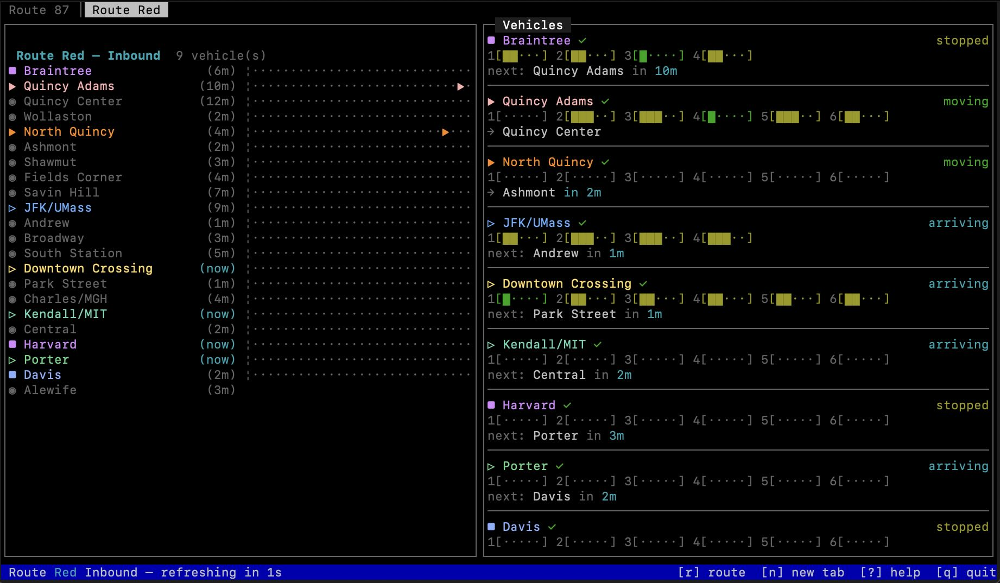

# MBTA Visualizer

A real-time terminal UI for tracking MBTA buses and subway trains, showing live vehicle positions, occupancy, and arrival predictions. Uses `blessed` for that authentic ncurses mouthfeel.



## Install

```bash
npm install -g mbta-vis
```

Then run:

```bash
mbta-vis [route] [direction]
```

## Usage

```bash
mbta-vis [route] [direction]

# Examples
mbta-vis 87 0        # Route 87, outbound
mbta-vis 57 1        # Route 57, inbound
mbta-vis Green-D 0   # Green Line D, outbound
```

Defaults to route `87`, direction `0` (outbound).

## Requirements

- Node.js 18+
- Internet connection

## API Key

No API key is required — the MBTA API is public and works unauthenticated. If you're running multiple tabs or refreshing frequently, you may hit the anonymous rate limit (20 req/min). To get a higher limit, grab a free key from [api.mbta.com](https://api.mbta.com) and set it in your shell:

```bash
export MBTA_API_KEY=your_key_here
```

Add that line to your `~/.zshrc` or `~/.bashrc` to make it permanent.

## Interface

The display is split into two panes:

**Left — Stop list**: All stops in route order with live vehicle markers and arrival ETAs. Vehicles are color-coded; the stop they occupy (or departed from) is highlighted in the same color.

**Right — Vehicle cards**: One card per active vehicle, sorted to match the stop list order. Each card shows:
- Status icon (`■` stopped, `▶` moving, `▷` arriving), current/departed stop, revenue indicator, occupancy
- Status label (`stopped` / `moving` / `arriving`) and speed in mph (when available)
- Destination and ETA on the next line (when in transit or arriving)
- Per-car occupancy bars for subway vehicles

## Keyboard Shortcuts

| Key | Action |
|-----|--------|
| `r` | Open route selector |
| `d` | Toggle inbound / outbound |
| `n` | New tab |
| `← →` / `Tab` / `1–9` | Switch tabs |
| `↑ ↓` / `j k` | Scroll stop list |
| `PgUp / PgDn` | Scroll by 10 stops |
| `?` | Help overlay |
| `q` / Ctrl-C | Quit |

## Local Development

```bash
git clone <repository-url>
cd mbta-vis
npm install
node src/main.js [route] [direction]
```

If running from source, you can also use a `.env` file for the API key:

```bash
cp .env.example .env
# edit .env and set MBTA_API_KEY=your_key_here
```

## License

MIT
